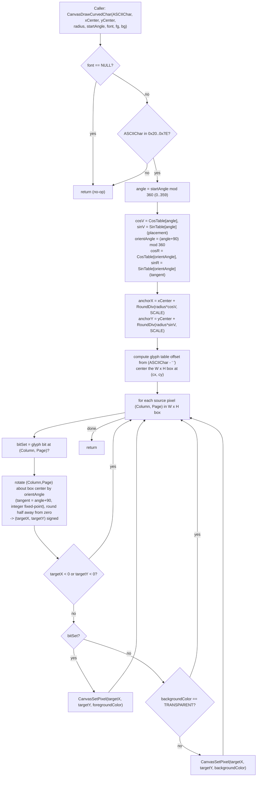

# Design Document

## Overview

`CanvasDrawCurvedChar` is a new drawing primitive added to the existing Canvas module
(`src/lib/GUI/Canvas.c`, prototype in `src/lib/GUI/Canvas.h`). It draws a single ASCII character
positioned on a circle of a given `radius` around a center point `(xCenter, yCenter)`, at a whole
degree `startAngle`, with the glyph rotated so its baseline stays tangent to the circle border.
This makes text follow the rim of the round 240x240 GC9A01 panel.

The primitive is the upright analogue of the existing `CanvasDrawChar`: it iterates the same 1bpp
`sFONT` glyph bitmaps, writes every pixel through the existing `CanvasSetPixel` API, and honors the
`TRANSPARENT` color-key background convention (Decision 14). The parameter order leads with the
character and the geometric placement values (`xCenter, yCenter, radius, startAngle`) so that a
future `CanvasDrawCurvedText` / `CanvasDrawCurvedNumber` can iterate characters by advancing
`startAngle` per glyph (see Design Decisions, "Reuse / extension point").

The design's central constraint is **cross-platform determinism** (Requirement 7): the same inputs
must produce a bit-for-bit identical set of written pixels on RP2040 (software float) and ESP32-S3
(hardware FPU). The implementation therefore performs **no floating-point math at runtime**. All
trigonometry is read from a precomputed fixed-point integer lookup table, and all rotation and
rounding is done in integer arithmetic, so the result is independent of each target's FPU.

### Scope

- In scope: drawing one character, circular placement, tangent rotation, font support, opaque and
  transparent backgrounds, bounds safety, platform-agnostic integer implementation.
- Out of scope (future specs): `CanvasDrawCurvedText`, `CanvasDrawCurvedNumber`, CN/`cFONT` curved
  rendering, sub-pixel anti-aliasing. The signature is designed to make the text/number helpers a
  thin loop over this primitive.

## Architecture

`CanvasDrawCurvedChar` lives entirely inside the Canvas module — no new files, no build-system
changes. `Canvas.c` is already listed in `GUILL_COMMON_SRCS` (root `CMakeLists.txt`) and in the
ESP32 `idf_component_register SRCS`, so adding a function to it requires no CMake edits. Following
the separate-compilation discipline (Decision 5 / §5):

- The **public prototype** is declared in `Canvas.h`, next to `CanvasDrawChar`.
- The **definition** lives in `Canvas.c`.
- Two **private helpers** and the **trig lookup table** are file-local `static` in `Canvas.c`, so
  they have no external linkage and cannot clash with other translation units.

The function sits in the same layer as `CanvasDrawChar`: it depends only on the `Canvas` global,
`CanvasSetPixel`, the `sFONT` type (`Fonts/fonts.h`), and the `TRANSPARENT`/`RGB_COLOR` macros from
`Canvas.h`. It is platform-agnostic with no `#ifdef`, no platform macros, and no function pointers
(Requirement 7.1).



## Components and Interfaces

### Public function

```c
/* Canvas.h — declared next to CanvasDrawChar */
void CanvasDrawCurvedChar(const char ASCIIChar, UINT16 xCenter, UINT16 yCenter,
    UINT16 radius, UINT16 startAngle, sFONT* font,
    UINT16 foregroundColor, UINT16 backgroundColor);
```

Parameter contract (Requirement 1):

| Parameter         | Type          | Meaning                                                        |
|-------------------|---------------|----------------------------------------------------------------|
| `ASCIIChar`       | `const char`  | Character to draw; valid range space (0x20) .. tilde (0x7E).   |
| `xCenter`         | `UINT16`       | Circle center X in canvas coordinates.                         |
| `yCenter`         | `UINT16`       | Circle center Y in canvas coordinates.                         |
| `radius`          | `UINT16`       | Distance in pixels from center to glyph anchor.                |
| `startAngle`      | `UINT16`       | Whole-degree placement angle; normalized mod 360 to 0..359.    |
| `font`            | `sFONT*`      | Font table (Font8/Font12/Font16/Font20/Font24); NULL = no-op.  |
| `foregroundColor` | `UINT16`       | RGB565 color for glyph (set) pixels.                           |
| `backgroundColor` | `UINT16`       | RGB565 color for non-glyph pixels, or `TRANSPARENT` to skip.   |

- Return type is `void`, consistent with `CanvasDrawChar` (Requirement 1.5).
- All parameters are camelCase (Requirement 1.4); the function name is PascalCase with the `Canvas`
  prefix (AGENTS.md §0).
- Order leads with the character then the geometric placement values, so a text helper can hold
  everything constant and advance only `startAngle` per glyph (Requirement 1.3).

### Private helpers (file-local `static` in `Canvas.c`)

```c
/* Integer round-half-away-from-zero division. denominator > 0.
   Uses 64-bit numerator to avoid overflow on radius * scaledTrig. */
static int32_t CanvasRoundDivAway(int64_t numerator, int32_t denominator);

/* Rotate a glyph-local doubled-delta pair (dx2, dy2) clockwise by the
   table-indexed angle and return the rounded integer offset components
   via outX/outY. dx2 = 2*Column - (Width-1), dy2 = 2*Page - (Height-1). */
static void CanvasRotateGlyphOffset(int32_t dx2, int32_t dy2,
    int32_t cosV, int32_t sinV, int32_t *outX, int32_t *outY);
```

These are `static` (no external linkage) exactly like the `static` libpng helpers already in
`Canvas.c` (Decision 13), so they never collide with symbols in other translation units.

### Reused existing interfaces

- `CanvasSetPixel(UINT16 xPoint, UINT16 yPoint, UINT16 color)` — the single write path. It already
  clips against `canvas.Width`/`canvas.Height`, applies `canvas.Rotate`/`canvas.Flip`, re-checks
  against `canvas.WidthMemory`/`canvas.HeightMemory`, and packs RGB565 big-endian for scale 65.
  `CanvasDrawCurvedChar` writes **only** through this function (Requirement 6.1).
- `sFONT { const uint8_t *table; uint16_t Width; uint16_t Height; }` — glyph dimensions are read
  from `font->Width`/`font->Height`; nothing is hardcoded (Requirement 4.3).
- `TRANSPARENT` / `RGB_COLOR` — the color-key convention (Decision 14).

## Data Models

### Glyph bitmap (unchanged, mirrors `CanvasDrawChar`)

A glyph is 1 bit per pixel, MSB-first within each byte, each row padded to a whole byte. The table
offset for a character is:

```
charOffset = (ASCIIChar - ' ') * font->Height * (font->Width / 8 + (font->Width % 8 ? 1 : 0))
```

The set/unset test for the pixel at `(Column, Page)` is `*ptr & (0x80 >> (Column % 8))`, advancing
`ptr` every 8 columns and once more per row when `font->Width % 8 != 0`. `CanvasDrawCurvedChar`
reuses this exact addressing so glyph indexing is identical to `CanvasDrawChar` (Requirements 4.1,
3.2).

### Fixed-point trigonometry table

To guarantee identical integer results on both targets independent of the FPU (Requirement 7.3),
trigonometry is stored as a **precomputed integer lookup table**, not computed at runtime.

- **Format:** Q16.16 signed fixed point. `SCALE = 65536` (`1 << 16`). A value `v` represents the
  real number `v / 65536.0`.
- **Storage type:** `int32_t` (sin/cos in `[-1, 1]` map to `[-65536, 65536]`, well within int32).
- **Tables:** two `static const int32_t` arrays of 360 entries each, indexed by whole degree
  `0..359`:

  ```c
  static const int32_t canvasCurvedCosTable[360] = { /* round(cos(deg * PI/180) * 65536) */ };
  static const int32_t canvasCurvedSinTable[360] = { /* round(sin(deg * PI/180) * 65536) */ };
  ```

- **How the literals are produced:** generated once offline by a small host script and embedded as
  constant literals in `Canvas.c`. They are compile-time constants, so both targets link the
  identical integers — there is no runtime `<math.h>` call and therefore no per-platform float
  divergence even when *building* the table. (Generating the table at runtime with `libm` is
  explicitly rejected — see Design Decisions.)
- **Size:** `360 * 4 * 2 = 2880` bytes of flash/rodata. Negligible on both targets.
- **Angle index:** `startAngle` is `UINT16` whole degrees; the runtime index is
  `angle = startAngle % 360`, which also implements the normalization required by Requirement 2.3
  (e.g. an angle that would be `-90` cannot occur as a `UINT16`, but any value `>= 360`, such as a
  text helper accumulating past a full turn, folds back into `0..359`).

### Coordinate model

- **Angle convention (Requirement 2.2):** 0 degrees at the three-o'clock position, increasing
  clockwise in screen coordinates (y grows downward). With `sin` measured on the downward y-axis,
  increasing the angle sweeps the anchor downward then leftward — i.e. visually clockwise.
- **Glyph anchor (Requirement 2.1, 2.5):**

  ```
  anchorX = xCenter + CanvasRoundDivAway((int64_t)radius * cosV, SCALE)
  anchorY = yCenter + CanvasRoundDivAway((int64_t)radius * sinV, SCALE)
  ```

  When `radius == 0` both offsets are 0, so the anchor is exactly `(xCenter, yCenter)`. The
  `radius * cosV` product uses `int64_t` because `UINT16 * SCALE` can exceed `int32_t`.

- **Glyph box center (Requirement 2.4):** the geometric center of the `Width x Height` box is
  `((Width - 1) / 2, (Height - 1) / 2)`. To stay in integer math, deltas are doubled:
  `dx2 = 2*Column - (Width - 1)`, `dy2 = 2*Page - (Height - 1)`. These are even/odd integers with
  no fractional loss; the single `/2` is folded into the final rounding division.

- **Rotation (Requirement 3.1, 3.3):** the glyph baseline must be **tangent** to the circle, not
  radial. Rotating the glyph by the placement `angle` alone would align its advance axis with the
  radial direction `(cos, sin)` (pointing out of the center), so the text would not read along the
  arc. The tangent at the placement angle is `(-sin, cos)`, i.e. the placement angle **plus 90
  degrees**, so the glyph orientation uses a separate `orientAngle = (angle + 90) % 360` with its
  own trig:

  ```
  cosR = canvasCurvedCosTable[(angle + 90) % 360]
  sinR = canvasCurvedSinTable[(angle + 90) % 360]
  rx = dx2 * cosR - dy2 * sinR      (scaled by SCALE, doubled)
  ry = dx2 * sinR + dy2 * cosR
  targetX = anchorX + CanvasRoundDivAway(rx, 2 * SCALE)   // /2 for the doubling, /SCALE for Q16.16
  targetY = anchorY + CanvasRoundDivAway(ry, 2 * SCALE)
  ```

  This makes the glyph advance axis follow the circle tangent (in the direction of increasing
  angle) and the glyph top point radially outward, so advancing `startAngle` sweeps a readable line
  of text along the border. At the top of the circle (`angle == 270`, where the tangent is
  horizontal) the effective glyph rotation is 0, i.e. an upright glyph. The anchor placement still
  uses the placement angle's `cosV`/`sinV`; only the glyph orientation uses `cosR`/`sinR`.
  `CanvasRoundDivAway` rounds halves away from zero (Requirement 3.3). `targetX`/`targetY` are
  computed as signed `int32_t` so a negative intermediate can be detected and skipped before any
  cast to the unsigned `UINT16` parameters of `CanvasSetPixel` (Requirement 6.3).

### Rendering algorithm (pseudocode)

```
CanvasDrawCurvedChar(ASCIIChar, xCenter, yCenter, radius, startAngle, font, fg, bg):
    if font == NULL: return                              # Req 4.4
    if ASCIIChar < 0x20 or ASCIIChar > 0x7E: return      # Req 4.5

    angle = startAngle % 360                             # Req 2.3
    cosV  = canvasCurvedCosTable[angle]                  # Req 7.3 (integer LUT) - placement
    sinV  = canvasCurvedSinTable[angle]
    orientAngle = (angle + 90) % 360                     # Req 3.1 (tangent orientation)
    cosR  = canvasCurvedCosTable[orientAngle]
    sinR  = canvasCurvedSinTable[orientAngle]

    anchorX = xCenter + RoundDivAway(radius * cosV, SCALE)   # Req 2.1, 2.5
    anchorY = yCenter + RoundDivAway(radius * sinV, SCALE)

    width = font->Width; height = font->Height           # Req 4.3
    charOffset = (ASCIIChar - ' ') * height * (width/8 + (width%8 ? 1 : 0))   # Req 4.1
    ptr = &font->table[charOffset]

    for Page in 0..height-1:                             # mirror CanvasDrawChar iteration
        for Column in 0..width-1:
            bitSet = (*ptr & (0x80 >> (Column % 8))) != 0
            dx2 = 2*Column - (width - 1)
            dy2 = 2*Page   - (height - 1)
            (offX, offY) = RotateGlyphOffset(dx2, dy2, cosR, sinR)   # Req 3.1, 3.3 (tangent)
            targetX = anchorX + offX
            targetY = anchorY + offY
            if targetX >= 0 and targetY >= 0:            # Req 6.3 (skip negative)
                if bitSet:
                    CanvasSetPixel(targetX, targetY, fg)              # Req 5.1
                else if bg != TRANSPARENT:
                    CanvasSetPixel(targetX, targetY, bg)              # Req 5.3
                # else: TRANSPARENT -> skip non-glyph pixel           # Req 5.2
            if Column % 8 == 7: ptr++
        if width % 8 != 0: ptr++
```

Iterating the full `Width x Height` source rectangle (including unset bits) is what lets the opaque
case fill the rotated bounding box (Requirement 5.3): every source cell is forward-mapped, set
cells get `foregroundColor`, unset cells get `backgroundColor`. For the `TRANSPARENT` case only set
cells are written, so the background shows through (Requirement 5.2). Because every write goes
through `CanvasSetPixel`, the most recently drawn character wins any overlapping coordinate
(Requirement 5.4) and all clipping/rotation/flip handling is applied (Requirement 6.1, 6.2, 6.4).

## Correctness Properties

*A property is a characteristic or behavior that should hold true across all valid executions of a
system — essentially, a formal statement about what the system should do. Properties serve as the
bridge between human-readable specifications and machine-verifiable correctness guarantees.*

These properties were derived from the acceptance-criteria prework and then consolidated to remove
redundancy: the four placement criteria collapse into one placement property (with directional
checks kept as example tests), the rotation/rounding/center criteria into one rotation invariant,
the indexing/origin/angle-0 criteria into one model-based equivalence against `CanvasDrawChar`, the
four bounds criteria into one memory-safety property, the two guard criteria into one no-op
property, and the two cross-platform criteria into one determinism property.

The properties are verified on a host build using an in-RAM canvas buffer (scale 65) and a mock or
real `CanvasSetPixel`, so 100+ iterations are cheap and FPU-independent.

### Property 1: Glyph anchor placement

*For any* center `(xCenter, yCenter)`, radius, and start angle, the glyph anchor computed by
`CanvasDrawCurvedChar` equals `(xCenter + RoundHalfAway(radius * cos(angle)), yCenter +
RoundHalfAway(radius * sin(angle)))` using the same Q16.16 fixed-point table, and when `radius` is
0 the anchor equals exactly `(xCenter, yCenter)`.

**Validates: Requirements 2.1, 2.5**

### Property 2: Angle normalization invariance

*For any* character, font, center, radius, and start angle, the set of written pixel coordinates
and their colors for `startAngle` is identical to the set for any other `UINT16` angle congruent to
it modulo 360 (e.g. an accumulated angle `>= 360` folds to the same `0..359` result).

**Validates: Requirements 2.3**

### Property 3: Upright equivalence with CanvasDrawChar at angle 270 (model-based)

*For any* printable character and supported font, rendering with `startAngle == 270` (the top of
the circle, where the tangent is horizontal and the effective glyph rotation is 0) produces a
foreground pixel pattern that, after removing the fixed glyph-box-center translation, is identical
to the upright `CanvasDrawChar` output for the same character and font — same glyph indexing, same
reference origin, same orientation. For fonts with an even `Width` or `Height`, the output may
differ from `CanvasDrawChar` by at most 1 pixel along the center seam — an inherent consequence of
round-half-away rotation about the glyph geometric center (D3). (Tangent orientation means the
upright case is at `startAngle == 270`, not 0; at `startAngle == 0` the glyph is rotated 90 degrees
so its baseline runs vertically down the right side of the circle.)

**Validates: Requirements 3.4, 3.2, 4.1**

### Property 4: Rotation preserves the glyph foreground

*For any* printable character, supported font, center, radius, and start angle, when the background
is `TRANSPARENT` the number of distinct foreground coordinates written equals the number of set
bits in the source glyph, within a small nearest-neighbor collision tolerance, and the glyph-box
center cell maps to within rounding tolerance of the anchor — i.e. rotation about the anchor
preserves the glyph content and rounds halves away from zero.

**Validates: Requirements 3.1, 3.3, 2.4**

### Property 5: Transparent background writes only glyph pixels

*For any* printable character, supported font, center, radius, and start angle, rendering with
`backgroundColor == TRANSPARENT` writes pixels only at the foreground (set-bit) coordinates — each
carrying `foregroundColor` — and leaves every other canvas coordinate unchanged from its prior
value. This written set equals the foreground subset of the opaque-mode write set for the same
inputs.

**Validates: Requirements 5.1, 5.2**

### Property 6: Opaque background fills the rotated bounding box

*For any* printable character, supported font, center, radius, and start angle, rendering with a
`backgroundColor` other than `TRANSPARENT` writes exactly the set of canvas coordinates produced by
forward-mapping the full `Width x Height` glyph rectangle (the rotated bounding box): set-bit cells
carry `foregroundColor` and non-set cells carry `backgroundColor`. When two characters are drawn in
sequence, any coordinate covered by both holds the value written by the most recently drawn
character.

**Validates: Requirements 5.3, 5.4**

### Property 7: Bounds and memory safety

*For any* character, font, center, radius, and start angle — including placements adjacent to or
beyond the canvas border — every coordinate `CanvasDrawCurvedChar` writes satisfies
`0 <= targetX <= canvas.Width` and `0 <= targetY <= canvas.Height`; no negative intermediate
coordinate is ever converted to a `UINT16` and passed to `CanvasSetPixel`; and no byte outside the
canvas buffer bounded by `canvas.WidthMemory` and `canvas.HeightMemory` is ever modified.

**Validates: Requirements 6.1, 6.2, 6.3, 6.4**

### Property 8: Invalid inputs are a no-op

*For any* canvas buffer contents and any argument values, calling `CanvasDrawCurvedChar` with a
`NULL` font, or with an `ASCIIChar` outside the inclusive range space (0x20) through tilde (0x7E),
leaves the canvas buffer byte-for-byte unchanged and accesses no glyph data.

**Validates: Requirements 4.4, 4.5**

### Property 9: Deterministic, float-free results

*For any* character, font, center, radius, and start angle, two invocations with identical inputs
produce an identical set of written coordinates and per-pixel color values; the result is a
function of the integer trig table alone, with no runtime floating-point operation — so identical
inputs yield identical integer pixel coordinates regardless of the target's floating-point
hardware.

**Validates: Requirements 7.2, 7.3**

## Error Handling

The primitive has no return value (Requirement 1.5), so error handling is by safe no-op and
defensive skipping rather than error codes — consistent with `CanvasDrawChar`.

| Condition | Handling | Requirement |
|-----------|----------|-------------|
| `font == NULL` | Return immediately before any glyph access; buffer unchanged. | 4.4 |
| `ASCIIChar` outside 0x20..0x7E | Return immediately before computing the table offset; buffer unchanged. | 4.5 |
| `startAngle >= 360` (or any out-of-range whole degree) | Normalized via `startAngle % 360` before lookup. | 2.3 |
| Negative intermediate rotated coordinate | Skip that pixel before any cast to `UINT16`; continue with remaining pixels. | 6.3 |
| `targetX > canvas.Width` or `targetY > canvas.Height` | `CanvasSetPixel` clips and ignores the write; the loop continues. | 6.2, 6.1 |
| Placement beyond the canvas border | Per-pixel skipping plus `CanvasSetPixel`'s own `WidthMemory`/`HeightMemory` guard keep all writes inside the buffer. | 6.4 |
| `radius == 0` | Anchor resolves to the center; rendering proceeds normally. | 2.5 |

The order of guards matters: the `NULL` font check runs first (so the out-of-range char check can
safely assume nothing about the font), then the char-range check, then per-pixel the negative-coord
check runs before the unsigned cast. The two early returns and the per-pixel negative skip are the
only places the function diverges from `CanvasDrawChar`'s flow.

## Testing Strategy

The feature is pure integer geometry over the existing glyph bitmaps, with a clear input/output
contract and strong universal properties (placement, rotation invariants, model equivalence,
bounds safety) — so property-based testing **is** appropriate and is the primary strategy,
complemented by targeted unit tests and a small set of build/integration checks for the structural
and cross-platform criteria.

### Test environment

- Tests run on a **host build** (not the MCU) using an in-RAM canvas configured at scale 65
  (RGB565), matching the production buffer layout. Where helpful, `CanvasSetPixel` is wrapped or
  observed to record the exact `(x, y, color)` writes.
- `canvas.Rotate = ROTATE_0` and `canvas.Flip = FLIP_NONE` for the core geometric properties, so
  written coordinates can be compared directly to the geometric model; a smaller set of cases
  exercises non-zero rotate/flip to confirm the writes still route through `CanvasSetPixel`.
- A **guard-padded buffer** (canary bytes around the canvas memory) backs Property 7 so any
  out-of-buffer write is detected.

### Property-based tests

- Use an established property-based testing library for C (for example **Theft** or a comparable
  C PBT harness); do **not** hand-roll the generator/shrinker framework.
- Each property runs a **minimum of 100 iterations**.
- Generators:
  - `ASCIIChar`: printable range 0x20..0x7E for valid cases; a separate generator of out-of-range
    bytes for Property 8.
  - `font`: drawn from { Font8, Font12, Font16, Font20, Font24 } so differing `Width`/`Height` are
    exercised (Requirements 4.2, 4.3).
  - `xCenter`, `yCenter`: within and slightly beyond canvas dimensions (to force border clipping
    for Property 7).
  - `radius`: including 0 (Property 1 / Requirement 2.5) up to values that push the glyph off the
    canvas.
  - `startAngle`: full `0..359`, plus values `>= 360` and multiples-of-360 offsets for Property 2.
- Each property test is tagged with a comment referencing its design property, in the format:
  `Feature: canvas-draw-curved-char, Property {number}: {property text}`.
- Mapping: Property 1..9 above each implemented by a **single** property-based test.

### Unit / example tests

- Directional convention (Requirement 2.2): angles 0, 90, 180, 270 place the anchor to the right,
  below, left, and above the center respectively.
- Half-away-from-zero rounding (Requirement 3.3): inputs that land exactly on `.5` offsets round
  away from zero.
- One smoke example per supported font confirming pixels are written (Requirements 4.2, 4.3).
- Overlap last-writer-wins (Requirement 5.4): two overlapping opaque characters; overlap holds the
  second character's value.

### Build / integration / static checks (non-PBT criteria)

- Signature and linkage (Requirements 1.1–1.5): a host and target compile against the `Canvas.h`
  prototype, plus code review for parameter names/order/types and `void` return.
- Platform-agnostic source (Requirement 7.1): grep/inspection confirms no `#ifdef`, platform
  macros, or function pointers around `CanvasDrawCurvedChar`; review confirms no runtime
  floating-point op (trig comes from the integer LUT).
- Cross-platform build (Requirement 7.4): build the RP2040 and ESP32-S3 targets; confirm the
  function links from the single `Canvas.c` with no target-specific variant.
- Cross-platform bit-for-bit identity (Requirement 7.2) is argued by construction — integer-only
  arithmetic plus a constant table — and surrogate-tested by the determinism property (Property 9).

## Design Decisions

### D1: Integer fixed-point trig LUT instead of runtime `<math.h>`

Requirement 7.3 demands identical integer pixel results on RP2040 (software float) and ESP32-S3
(hardware FPU). Calling `sinf`/`cosf` at runtime risks last-ULP differences between the two libm
implementations that occasionally round to a different integer pixel. A precomputed Q16.16 integer
table (generated offline, embedded as constant literals) removes all runtime float: the result is a
pure function of constant integers, so both targets compute bit-for-bit identical writes. The table
is ~2.8 KB of rodata — negligible. A 90-entry quarter table with quadrant symmetry was considered
but rejected: the full 360-entry table is branch-free and simpler, and the size saving is trivial.

### D2: Forward mapping (source-driven) rotation

The function iterates the source glyph rectangle and forward-maps each cell through the rotation,
mirroring `CanvasDrawChar`'s iteration. This makes the `startAngle == 270` case (tangent horizontal,
effective rotation 0) provably equivalent to `CanvasDrawChar` (Property 3) and defines the opaque
"rotated bounding box" exactly as Requirement 5.3 states (the forward-mapped `Width x Height` set).
The known tradeoff is nearest-neighbor
**aliasing**: at some angles forward mapping can leave 1-pixel gaps or map two source cells to one
destination, so the opaque fill is not guaranteed gap-free. Requirement 5.3 defines the bounding box
as precisely this forward-mapped set, so the behavior is correct by definition; Property 4 bounds
the foreground collision with a small tolerance. A destination-driven inverse mapping would
eliminate gaps but diverge from the `CanvasDrawChar` mirror and complicate the angle-270 equivalence;
it is deferred unless visual quality requires it.

### D3: Doubled-delta integer rotation about the box center

To rotate about the geometric center `((Width-1)/2, (Height-1)/2)` without floating point, deltas
are doubled (`dx2 = 2*Column-(Width-1)`) so the half-pixel center is represented exactly as an
integer, and the `/2` is folded into the final round-half-away division. This keeps the whole
transform in integer arithmetic with a single rounding step (Requirement 3.3) and avoids
accumulating fractional error.

### D4: Signed intermediate coordinates, checked before the unsigned cast

`CanvasSetPixel` takes `UINT16` (unsigned) coordinates, so a negative rotated coordinate would wrap
to a huge value and bypass the upper-bound guard. The rotation therefore computes `targetX/targetY`
as signed `int32_t` and skips any pixel with a negative component **before** casting (Requirement
6.3). The `radius * cosV` product uses `int64_t` to avoid overflow since `radius` is a `UINT16`.

### D5: Reuse / extension point for curved text and numbers (out of scope)

The signature leads with `ASCIIChar` followed by the geometric placement values so that a future
`CanvasDrawCurvedText` / `CanvasDrawCurvedNumber` can loop over characters, holding center, radius,
font, and colors constant while advancing `startAngle` by an angular step derived from glyph width
and radius (arc length `step ≈ glyphAdvance / radius`, converted to whole degrees). Those helpers
are intentionally **out of scope** for this spec; only the single-character primitive is built here.
