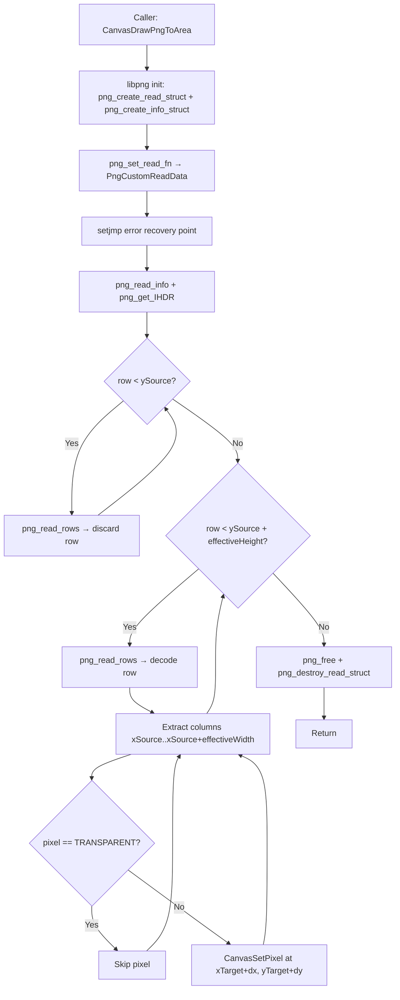

# Design Document

## Overview

`CanvasDrawPngToArea` is a new method in the Canvas module that decodes a rectangular sub-area of a PNG file and composites it into the canvas texture at a specified target position, skipping pixels that match the TRANSPARENT color key (0xF81F). It is a structural copy of `CanvasDrawPng` — same libpng pipeline, same error handling, same variable names, same comments, same binary notation — with three localized behavioral additions layered on top:

1. **Row skipping/stopping**: Rows before `ySource` are decoded (to advance libpng's DEFLATE state) but their pixels are not extracted. Once `ySource + height` rows are reached, decoding stops immediately.
2. **Sub-area column extraction**: Within active rows, only columns `[xSource, xSource + effectiveWidth)` are extracted and written to the canvas.
3. **Transparency filtering**: Pixels whose RGB565 value equals TRANSPARENT (0xF81F) are not written to the canvas.

The method enables sprite-like compositing from PNG atlases: a caller can extract an icon from a larger spritesheet and overlay it onto existing canvas content without erasing the background.

## Architecture



The function lives entirely within `Canvas.c`, reusing the existing `static` helpers `PngCustomReadData` and `PngShowError`. No new files, no new dependencies, no build system changes.

## Components and Interfaces

### Public Interface

```c
// Canvas.h — new prototype added after CanvasDrawPng
void CanvasDrawPngToArea(FIL *file, UINT16 xSource, UINT16 ySource,
    UINT16 width, UINT16 height, UINT16 xTarget, UINT16 yTarget);
```

**Parameters:**

| Parameter | Type | Description |
|-----------|------|-------------|
| `file` | `FIL *` | Open FatFS file handle, positioned at start of PNG data |
| `xSource` | `UINT16` | Left column of the source rectangle within the PNG |
| `ySource` | `UINT16` | Top row of the source rectangle within the PNG |
| `width` | `UINT16` | Width of the source rectangle (columns to extract) |
| `height` | `UINT16` | Height of the source rectangle (rows to extract) |
| `xTarget` | `UINT16` | X coordinate in the canvas where the top-left pixel is placed |
| `yTarget` | `UINT16` | Y coordinate in the canvas where the top-left pixel is placed |

### Reused Internal Helpers (already in Canvas.c)

- `static void PngCustomReadData(png_structrp pngPointer, png_bytep data, size_t length)` — reads PNG data from FatFS file via `f_read`
- `static void PngShowError(png_structp pngPointer, const char *message)` — prints libpng error via SHOWDEBUG

### Dependency Chain (unchanged)

```
CanvasDrawPngToArea → libpng (png_create_read_struct, png_read_rows, ...)
                    → FatFS (FIL, f_read via PngCustomReadData)
                    → CanvasSetPixel (pixel output)
```

## Data Models

No new data structures. The function operates on:

- `Canvas canvas` (existing global) — provides `canvas.Width`, `canvas.Height` for clipping
- `FIL *file` (FatFS file handle) — PNG data source
- `png_structp` / `png_infop` (libpng state) — transient, allocated and freed within the function
- `png_bytep rowBuffer` (row decode buffer) — allocated per-row via `png_malloc`, freed after extraction

### RGB565 Pixel Layout

The conversion from decoded RGB888 to RGB565 uses the identical binary-literal formula from `CanvasDrawPng`:

```c
UINT16 color = (UINT16)(((red & 0b11111000) | ((green & 0b11100000) >> 5)) << 8)
    | (UINT16)(((green & 0b00011100) << 3) | ((blue & 0b11111000) >> 3));
```

The TRANSPARENT sentinel is `0xF81F` (RGB565 magenta = R:31, G:0, B:31).

### Effective Dimensions Clamping

Before the row loop begins, effective dimensions are computed:

```
effectiveWidth  = min(width, pngWidth - xSource)    // clamp to PNG bounds
effectiveHeight = min(height, pngHeight - ySource)  // clamp to PNG bounds
maxCol = min(effectiveWidth, canvas.Width - xTarget) // clamp to canvas bounds
maxRow = effectiveHeight  // canvas Y clipping done per-pixel via CanvasSetPixel, or pre-computed
```

If `xSource >= pngWidth` or `ySource >= pngHeight`, effective dimensions are zero and the function produces no pixel output (early return after cleanup).

## Error Handling

Error handling is identical to `CanvasDrawPng`:

| Condition | Behavior |
|-----------|----------|
| `file == NULL` | Return immediately, no allocations |
| `png_create_read_struct` fails | Return immediately |
| `png_create_info_struct` fails | `png_destroy_read_struct`, return |
| libpng error (longjmp) | Free `rowPointers` if non-NULL, `png_destroy_read_struct`, return |
| `xSource >= pngWidth` or `ySource >= pngHeight` | Zero effective area — proceed to cleanup with no pixel writes |
| Target pixel outside canvas bounds | Skipped — `CanvasSetPixel` has its own boundary check, but we also pre-clamp `maxCol`/`maxRow` to avoid unnecessary iterations |

The `volatile png_bytep rowPointers` pattern is preserved exactly: assigned before any `png_read_rows` call so the longjmp cleanup path can free it.

## Testing Strategy

Per the project's **Testing Policy (AGENTS.md)**: no automated tests are written. Verification is done exclusively by building the firmware (RP2040 / ESP32-S3) and running on hardware.

**Why PBT does not apply:** This is an embedded C project with no test framework, no test build system, and an explicit policy against automated tests. The function is a faithful structural copy of existing code with localized behavioral changes — correctness is verified visually on the target LCD panel. Property-based testing requires a test harness, mocking of FatFS/libpng I/O, and a host-side build target, none of which exist or are desired.

**Verification approach:**
1. **Compile-time**: Clean build on both RP2040 (cmake + make) and ESP32 (idf.py) with zero warnings
2. **On-hardware validation**: Load a PNG spritesheet to SD, call `CanvasDrawPngToArea` with various source rectangles, verify correct sub-area appears at the target position on the LCD
3. **Transparency check**: Use a PNG with magenta (255, 0, 255) pixels in the source area, confirm those pixels leave the underlying canvas content visible
4. **Edge cases on hardware**: source area partially outside PNG bounds, target near canvas edge, full-image extraction (xSource=0, ySource=0, width=pngWidth, height=pngHeight) matching `CanvasDrawPng` output
