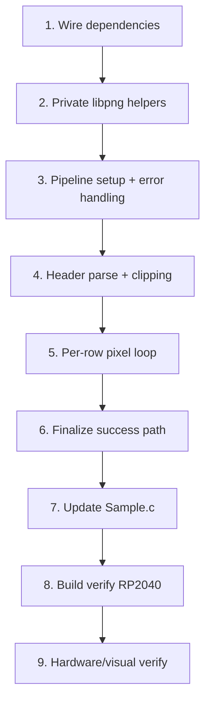

# Implementation Plan

## Overview

This plan implements `CanvasDrawPng`, a faithful copy of `LCDRenderPng` that writes decoded RGB565
pixels into the in-RAM canvas buffer via `CanvasSetPixel` instead of streaming them to the LCD
panel. Work proceeds bottom-up: wire dependencies, add the private libpng helpers, then build the
function in layers (setup/error handling → header parse + clipping → per-row pixel loop → success
finalize), switch `Sample.c` to the RAM-compositing flow, and finish with build and on-hardware
verification on RP2040. `LCDRenderer.c`/`.h` stay untouched.

## Tasks

- [x] 1. Wire up Canvas module dependencies for PNG decoding
  - In `src/lib/GUI/Canvas.h`, add `#include "ff.h"` so the `FIL` type is visible to the prototype, and declare `void CanvasDrawPng(FIL *file);` alongside the other `Canvas*` drawing-API prototypes (near `CanvasDrawImage`/`CanvasDrawBitmap`).
  - In `src/lib/GUI/Canvas.c`, add the includes needed by the decode path: `<png.h>`, `"ff.h"`, and `"Debug.h"` (for `SHOWDEBUG`).
  - Do not modify `src/lib/LCD/1in28/LCDRenderer.c` or `LCDRenderer.h`.
  - _Requirements: 1.1, 1.2, 1.3, 9.1, 9.2_

- [x] 2. Add the private libpng helper functions to Canvas.c
  - Define `static void PngCustomReadData(png_structrp pngPointer, png_bytep data, size_t length)` reading from the `FIL *` via `png_get_io_ptr` + `f_read`, identical to the `LCDRenderer.c` version (including the `SHOWDEBUG(".")` trace).
  - Define `static void PngShowError(png_structp pngPointer, const char *message)` with the same `SHOWDEBUG("Error from libpng: %s\n", message)` body.
  - Keep both `static` (file-local) so there is no link conflict with the non-static `PngCustomReadData` in `LCDRenderer.c`.
  - _Requirements: 2.1, 2.3, 9.1, 11.1_

- [x] 3. Implement the CanvasDrawPng decode pipeline (setup + error handling)
  - Define `void CanvasDrawPng(FIL *file)` in `Canvas.c`.
  - Reproduce the `LCDRenderPng` setup verbatim: `png_create_read_struct(PNG_LIBPNG_VER_STRING, NULL, PngShowError, NULL)` with null-check returning early; `png_create_info_struct` with null-check destroying the read struct and returning; `png_set_read_fn(pngPointer, file, PngCustomReadData)`.
  - Declare `volatile png_bytep rowPointers = NULL;` before the jump point; do NOT declare `lcdSelected`.
  - Establish `setjmp(png_jmpbuf(pngPointer))`; in the error block free `rowPointers` when non-null and `png_destroy_read_struct(&pngPointer, &infoPointer, NULL)` then return — omitting the chip-select restoration line.
  - Replicate the `SHOWDEBUG` traces and comments tied to these retained steps verbatim.
  - _Requirements: 2.1, 2.2, 2.4, 7.1, 7.2, 7.3, 7.4, 7.5, 4.4, 4.6, 11.1, 11.2, 11.3_

- [x] 4. Implement header parsing and canvas-based clipping
  - Call `png_read_info` then `png_get_IHDR(...)` to obtain width, height, bitDepth, colorType, interlaceType (keep the "Parsing image info" / "PNG info" traces and the `png_read_info` comment).
  - Compute `maxCol = width > canvas.Width ? canvas.Width : width;` and `maxRow = height > canvas.Height ? canvas.Height : height;` (clip to the canvas, not the panel), with a comment noting writes stay inside the canvas.
  - Read the palette once with `png_get_PLTE` when `colorType == PNG_COLOR_TYPE_PALETTE`.
  - Do NOT emit `LCDSetDisplayArea`, DC/CS `DigitalWrite`, or the `lcdSelected = true` line.
  - _Requirements: 2.4, 4.1, 4.2, 4.3, 5.1, 6.1, 6.2, 6.3, 6.4, 6.5, 11.2_

- [x] 5. Implement the per-row decode loop writing pixels into the canvas buffer
  - For each row `0..maxRow-1`: `png_malloc` a row buffer sized by `png_get_rowbytes`, track it in `rowPointers`, `png_read_rows(..., 1)`.
  - For each column `0..maxCol-1`: extract `{red, green, blue}` using the palette path (when `colorType == PNG_COLOR_TYPE_PALETTE` and `palette != NULL`) or the sequential 3-byte path otherwise (the null-palette fallback), matching `LCDRenderPng` including the fallback comment.
  - Pack RGB565 with the identical bit math and write via `CanvasSetPixel(col, row, color)` instead of the two `SPIWriteByte` calls: `UINT16 color = (UINT16)(((red & 0b11111000) | ((green & 0b11100000) >> 5)) << 8) | (UINT16)(((green & 0b00011100) << 3) | ((blue & 0b11111000) >> 3));` (keep the RGB565 format comment).
  - After each row, `png_free` the row buffer and reset `rowPointers = NULL`.
  - _Requirements: 2.5, 2.6, 3.1, 3.2, 3.3, 3.4, 5.2, 5.3, 5.4, 11.2_

- [x] 6. Finalize the success path
  - After the row loop, call `png_destroy_read_struct(&pngPointer, &infoPointer, NULL)` exactly once and return.
  - Omit `DriverSendCommand(0x29)` and the "LCD SPI released" trace/CS line (those belong to the panel path).
  - _Requirements: 4.3, 4.5, 8.1, 8.2, 8.3, 11.3_

- [x] 7. Update Sample.c to compose via the texture buffer
  - Replace the direct `LCDRenderPng(&file)` call in the SD block with `CanvasDrawPng(&file)`, keeping the sequence: allocate texture → `CanvasNewImage` → `CanvasSetScale(65)` → mount/open → `CanvasDrawPng(&file)` → close/unmount → `CanvasDrawText(...)` → `LCDRenderTexture(texture)`.
  - Ensure the canvas is configured (scale 65, dimensions = `LCD.WIDTH`/`LCD.HEIGHT`) before `CanvasDrawPng` so clipping and the RGB565 byte layout are correct.
  - _Requirements: 1.4, 3.1_

- [x] 8. Build and verify on RP2040
  - Run the incremental/full RP2040 build; confirm zero compilation and linker errors and that `Canvas.c` compiles with the new includes.
  - Confirm `compile_commands.json` gains a `CanvasDrawPng` entry and clangd reports no diagnostics on `Canvas.c`.
  - _Requirements: 10.1, 10.2_

- [x] 9. Hardware/visual verification on RP2040
  - Flash and run the `Sample.c` flow: confirm the PNG appears via the single `LCDRenderTexture` blit with no top-to-bottom scan/flicker, and the text overlays the image correctly.
  - Confirm a PNG larger than the canvas is clipped with no visible corruption (boundary check) and that the legacy `LCDRenderPng` path, if invoked, still renders directly to the panel unchanged.
  - _Requirements: 6.5, 9.3, 10.3_

## Task Dependency Graph



```json
{
  "waves": [
    { "wave": 1, "tasks": ["1"], "dependsOn": [] },
    { "wave": 2, "tasks": ["2"], "dependsOn": ["1"] },
    { "wave": 3, "tasks": ["3"], "dependsOn": ["2"] },
    { "wave": 4, "tasks": ["4"], "dependsOn": ["3"] },
    { "wave": 5, "tasks": ["5"], "dependsOn": ["4"] },
    { "wave": 6, "tasks": ["6"], "dependsOn": ["5"] },
    { "wave": 7, "tasks": ["7"], "dependsOn": ["6"] },
    { "wave": 8, "tasks": ["8"], "dependsOn": ["7"] },
    { "wave": 9, "tasks": ["9"], "dependsOn": ["8"] }
  ]
}
```

## Notes

- Tasks 3–6 build a single function (`CanvasDrawPng`) incrementally; they are sequential because
  each adds the next block of the same function body. They may be implemented in one pass but are
  split to keep each change reviewable and mapped to specific requirements.
- The only files edited are `src/lib/GUI/Canvas.c` and `src/lib/GUI/Canvas.h`, plus `src/Sample.c`
  for the demonstration flow. `LCDRenderer.c`/`.h` remain untouched (Requirement 9).
- No build-system changes are needed: `Canvas.c` is already in the RP2040 `GUILL_COMMON_SRCS` and
  the ESP32 `idf_component_register SRCS`, and libpng/FatFS are already linked.
- ESP32 is parity-only here (no configured local build); RP2040 is the hardware-validated target.
- Verification follows the project's practice (build + on-hardware visual check); there is no unit
  test harness in this codebase.
