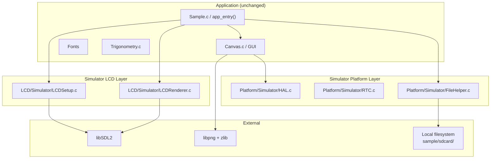
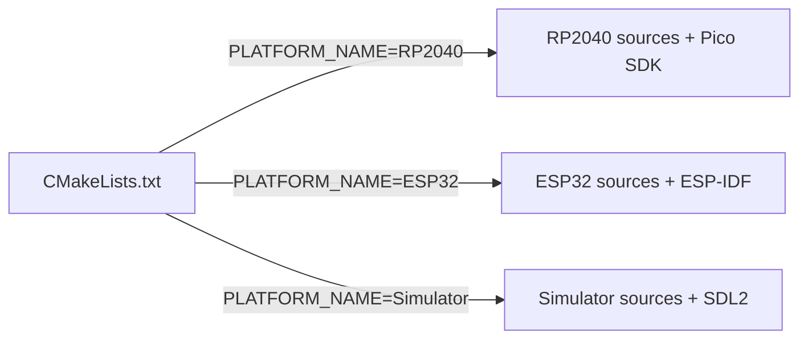

# Design Document: LCD Simulator

## Overview

The LCD Simulator adds a third platform target (`Simulator`) to gui.ll, producing a native desktop executable that renders the 240×240 RGB565 display in an SDL2 window. This enables rapid screen-design iteration without flashing firmware to hardware.

The simulator reuses `Sample.c` and all shared code unchanged. It swaps in platform-specific stubs (HAL no-ops, SDL2-backed LCD, POSIX file I/O) selected at build time via `cmake -DPLATFORM_NAME=Simulator`.

### Design Goals

- **Zero changes to application code**: `Sample.c`, `Canvas.c`, and all shared modules compile identically
- **Minimal surface area**: only implement what's called — HAL functions become no-ops, file I/O delegates to POSIX, LCD renders to SDL2
- **Follow existing platform patterns**: new files mirror the `Platform/RP2040/` and `LCD/1in28/` structure

### Key Design Decisions

1. **SDL2 for display** — widely available (`apt install libsdl2-dev`), well-suited for pixel-buffer blitting, and handles window events natively
2. **Byte-swap in LCDRenderTexture** — the canvas buffer stores RGB565 in big-endian (SPI byte order from `CanvasSetPixel`); SDL2 expects native-endian, so each pixel is byte-swapped before `SDL_UpdateTexture`
3. **No FatFS in simulator** — file operations use standard `fopen`/`fread`/`fclose`; a thin compatibility layer provides `FIL`, `FRESULT`, and `f_read` so shared code compiles without modification
4. **Delay() integrates SDL event pump** — prevents the window from becoming unresponsive during the main loop's `Delay(1000)` calls
5. **No Driver/GC9A01** — the simulator LCD layer replaces both `LCDSetup` and `LCDRenderer` entirely, no SPI/GPIO register init needed

---

## Architecture



### Build-Time Platform Selection



The root `CMakeLists.txt` gains an `elseif(PLATFORM_NAME STREQUAL "Simulator")` branch that:
- Sets C11 standard, no cross-compiler (uses host `cc`)
- Defines `GUILL_SIM_SRCS` (simulator-specific sources)
- Finds SDL2 via `find_package(SDL2 REQUIRED)`
- Builds zlib/libpng from submodules (same `zlibstatic.cmake` approach as RP2040)
- Links `SDL2`, `png_static`, `zlibstatic`, `m`
- Produces a native executable `gui.ll`

---

## Components and Interfaces

### Platform/Simulator/HAL.c + HAL.h

Provides the full HAL interface as no-op stubs so that `Driver.c`, `Canvas.c`, and any shared code referencing HAL functions compiles and links.

**HAL.h** includes:
- `Types.h` for `UINT8`/`UINT16`/`UINT32`
- `HALConfig.h` for pin/constant defines
- Pico-SDK-compatible constant macros: `GPIO_FUNC_SPI`, `GPIO_IN`, `GPIO_OUT`, `GPIO_FUNC_PWM`, `PWM_CHAN_B`
- All function prototypes matching the RP2040 HAL signatures

**HAL.c** implements:
- `Delay(ms)` — SDL event-pump loop with `SDL_GetTicks` + `SDL_PollEvent` + `SDL_Delay(1)` per iteration; exits on `SDL_QUIT`
- All other functions — empty bodies, non-void ones return 0

### Platform/Simulator/HALConfig.h

Dummy pin/peripheral defines with distinct non-negative integer values:

```c
#define LCD_DC_PIN   0
#define LCD_CS_PIN   1
#define LCD_CLK_PIN  2
#define LCD_MOSI_PIN 3
#define LCD_RST_PIN  4
#define LCD_BL_PIN   5
#define SD_SPI_CS    6
#define SD_SPI_SCLK  7
#define SD_SPI_MOSI  8
#define SD_SPI_MISO  9
#define SD_SPI_BAUDRATE 25000000
#define SD_DETECT_PIN   10
#define SD_DIRECTORY "sample/sdcard"
```

### Platform/Simulator/RTC.c + RTC.h

- `RTCInitialize()` — no-op
- `get_fattime()` — returns host time as FAT timestamp via `time()` + `localtime()`, packed per the FAT spec (bits 31-25: year-1980, 24-21: month, 20-16: day, 15-11: hour, 10-5: minute, 4-0: second/2)
- Defines `DWORD` as `unsigned int` if not already available

### Platform/Simulator/FileHelper.c + FileHelper.h

Replaces the FatFS-based `Helper/FileHelper.c`. Provides the same public API (`MountSdCard`, `SelectActiveDrive`, `OpenFile`, `CloseFile`, `UnMountSdCard`) using POSIX file I/O.

**FIL type** — a struct wrapping `FILE*`:

```c
typedef struct {
    FILE *filePointer;
} FIL;
```

**FatFS compatibility types** defined in a local header or at the top of FileHelper.c:

```c
typedef unsigned int UINT;
typedef unsigned int DWORD;
typedef enum { FR_OK = 0, FR_INVALID_OBJECT = 9 } FRESULT;
```

**f_read** — delegates to `fread`:

```c
FRESULT f_read(FIL *fp, void *buff, UINT btr, UINT *br) {
    if (!fp || !fp->filePointer) { *br = 0; return FR_INVALID_OBJECT; }
    *br = (UINT)fread(buff, 1, btr, fp->filePointer);
    return FR_OK;
}
```

**MountSdCard** — checks that `SD_DIRECTORY` exists via `opendir`/`closedir`:

```c
bool MountSdCard(void) {
    DIR *dir = opendir(SD_DIRECTORY);
    if (!dir) return false;
    closedir(dir);
    return true;
}
```

**SelectActiveDrive** — returns `true` (no-op).

**OpenFile** — opens `SD_DIRECTORY/filename` with `fopen("rb")`.

**CloseFile** — calls `fclose`.

**UnMountSdCard** — no-op.

### LCD/Simulator/LCDSetup.c + LCDSetup.h

The simulator reuses the **same `LCDSetup.h`** header interface as the hardware version (defines `LCD_ATTRIBUTES`, `LCD_HEIGHT`, `LCD_WIDTH`, `HORIZONTAL`, `VERTICAL`, `extern LCD_ATTRIBUTES LCD`, prototype for `LCDInitialize()`).

**LCDSetup.c** implements `LCDInitialize()`:
1. `SDL_Init(SDL_INIT_VIDEO)`
2. `SDL_CreateWindow("LCD Simulator", centered, 240×240, SDL_WINDOW_SHOWN)`
3. `SDL_CreateRenderer(window, -1, SDL_RENDERER_ACCELERATED)`
4. `SDL_CreateTexture(renderer, SDL_PIXELFORMAT_RGB565, SDL_TEXTUREACCESS_STREAMING, 240, 240)`
5. Sets `LCD.WIDTH = 240`, `LCD.HEIGHT = 240`, `LCD.SCAN_DIR = HORIZONTAL`
6. Returns `EXIT_SUCCESS` or non-zero on any SDL failure (with `fprintf(stderr, ...)` diagnostic)

SDL objects (window, renderer, texture) are stored as file-local `static` globals, accessed by `LCDRenderer.c` via internal helper functions or shared statics (within the same translation unit pair — exposed via an internal header `LCDSimInternal.h` if needed, or as `extern` in the `.c` files since both are simulator-only).

### LCD/Simulator/LCDRenderer.c + LCDRenderer.h

The simulator reuses the **same `LCDRenderer.h`** header interface (same function signatures as the hardware version). The `#include "ff.h"` in the hardware header is replaced by the simulator's own FIL/FRESULT types header.

**LCDRenderTexture(texture)**:
1. Byte-swap each pixel: `swapped[i] = (pixel << 8) | (pixel >> 8)` for all 240×240 pixels
2. `SDL_UpdateTexture(texture, NULL, swapped, 480)` — pitch = 240 × 2 bytes
3. `SDL_RenderCopy(renderer, sdlTexture, NULL, NULL)`
4. `SDL_RenderPresent(renderer)`

**LCDRenderTextureInArea(xStart, yStart, xEnd, yEnd, texture)**:
1. For each row `y` from `yStart` to `yEnd-1`, byte-swap the sub-row from the full 240-wide buffer at offset `xStart + y * 240`
2. Update the SDL texture at rect `(xStart, yStart, xEnd-xStart, yEnd-yStart-1)` via `SDL_UpdateTexture` with the swapped sub-region
3. Present

**LCDRenderPoint(x, y, color)**:
1. Byte-swap the single pixel
2. `SDL_UpdateTexture` with a 1×1 rect
3. Present

**LCDClear(fillColor)**:
1. Fill a 240×240 buffer with `fillColor` (no byte-swap — matches hardware behavior where the caller already pre-swaps)
2. `SDL_UpdateTexture` + present

**LCDRenderPng(file)** — identical logic to the hardware `LCDRenderer.c` version but writes decoded RGB565 pixels to an intermediate buffer and then uses `SDL_UpdateTexture` to display. Alternatively, since `Sample.c` already uses `CanvasDrawPng` (canvas path) rather than `LCDRenderPng` directly, this can be a minimal stub that calls through the same pipeline.

**LCDSetDisplayArea** — no-op (area tracking not needed; SDL texture updates use explicit rects).

---

## Data Models

### LCD_ATTRIBUTES (unchanged)

```c
typedef struct {
    UINT16 WIDTH;
    UINT16 HEIGHT;
    UINT8 SCAN_DIR;
} LCD_ATTRIBUTES;
```

### FIL (simulator version)

```c
typedef struct {
    FILE *filePointer;
} FIL;
```

### FatFS Compatibility Types

```c
typedef unsigned int UINT;
typedef unsigned int DWORD;
typedef unsigned char BYTE;
typedef enum {
    FR_OK = 0,
    FR_INVALID_OBJECT = 9
} FRESULT;
```

### SDL2 State (file-local statics in LCDSetup.c / LCDRenderer.c)

```c
static SDL_Window *sdlWindow;
static SDL_Renderer *sdlRenderer;
static SDL_Texture *sdlTexture;
```

---

## Error Handling

| Scenario | Behavior |
|----------|----------|
| `SDL_Init` fails | Print to stderr, return non-zero from `LCDInitialize()` |
| SDL window/renderer/texture creation fails | Print to stderr, destroy already-allocated SDL resources, return non-zero |
| `SDL_QUIT` event received | `exit(0)` from `Delay()` — clean termination |
| `SD_DIRECTORY` does not exist | `MountSdCard()` returns `false`; `Sample.c` skips file loading |
| `fopen` fails in `OpenFile` | Returns `false`; caller skips image rendering |
| `f_read` called with NULL `FILE*` | Sets `*br = 0`, returns `FR_INVALID_OBJECT` |
| `malloc` fails for texture in `Sample.c` | `exit(EXIT_FAILURE)` (existing behavior, unchanged) |

Error handling follows the existing project pattern: print a diagnostic to stdout/stderr and return an error code. No exceptions, no asserts, no abort.

---

## Correctness Properties

Per the project's Testing Policy (no automated tests), formal correctness properties are not encoded as executable tests. The following invariants are verified manually at build and runtime:

### Property 1: API Parity

The simulator exposes the exact same function signatures as the hardware LCD and FileHelper modules — `Sample.c` compiles without modification across all three platforms.

**Validates: Requirements 4, 10**

### Property 2: Pixel Fidelity

After byte-swap, the SDL2 window displays the same RGB565 colors that the GC9A01 panel would show for any given canvas buffer content.

**Validates: Requirements 2, 3**

### Property 3: Event Responsiveness

The SDL2 window processes quit events within one `Delay()` cycle, preventing the OS from marking the window as unresponsive.

**Validates: Requirements 5**

### Property 4: File I/O Equivalence

`f_read` on the simulator produces identical byte sequences as FatFS `f_read` for the same file content, ensuring PNG decode produces identical canvas buffers.

**Validates: Requirements 6, 7**

### Property 5: Build Isolation

Adding `PLATFORM_NAME=Simulator` to CMake does not affect the RP2040 or ESP32 build paths — no shared source files are modified.

**Validates: Requirements 9**

---

## Testing Strategy

**Property-based testing does not apply to this feature.** The simulator is infrastructure code — HAL stubs, SDL2 window management, file I/O wrapping, and CMake build configuration. There are no pure functions with universal properties; behavior is verified by building and running the executable visually.

**Verification approach** (per project policy — no automated tests):

1. **Build verification**: `cmake -DPLATFORM_NAME=Simulator && make` produces a native executable without errors or warnings
2. **Runtime verification**: running the executable displays the SDL2 window with `01.png` rendered and the counter loop animating
3. **Cross-platform build check**: existing RP2040/ESP32 builds remain unaffected (no changes to shared code or their cmake paths)
4. **Graceful degradation**: running without `sample/sdcard/01.png` skips image rendering and continues to the counter loop

**Build tasks** (VS Code / Kiro):
- "Build: Full Simulator" — clean cmake configure + make
- "Setup: Simulator toolchain in WSL2" — installs `libsdl2-dev`
- "Debug Simulator" — launch.json configuration for GDB debugging

---

## File Layout Summary

```
src/lib/
├── Platform/Simulator/
│   ├── HAL.c              # No-op stubs + Delay with SDL event pump
│   ├── HAL.h              # Function prototypes + Pico-SDK compat constants
│   ├── HALConfig.h        # Dummy pin defines + SD_DIRECTORY
│   ├── RTC.c              # RTCInitialize (no-op) + get_fattime (host time)
│   ├── RTC.h              # RTCInitialize prototype
│   └── FileHelper.c       # POSIX file I/O (MountSdCard, OpenFile, etc.)
│
├── LCD/Simulator/
│   ├── LCDSetup.c         # SDL2 init, window/renderer/texture creation
│   ├── LCDSetup.h         # Same interface as LCD/1in28/LCDSetup.h
│   ├── LCDRenderer.c      # SDL2 texture update + present (with byte-swap)
│   └── LCDRenderer.h      # Same interface as LCD/1in28/LCDRenderer.h
│
sample/sdcard/
└── 01.png                  # 240×240 test image (versioned)

Toolchain/Simulator/
└── Setup.sh               # apt install libsdl2-dev (idempotent)
```
