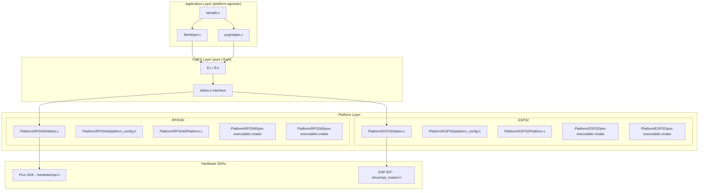
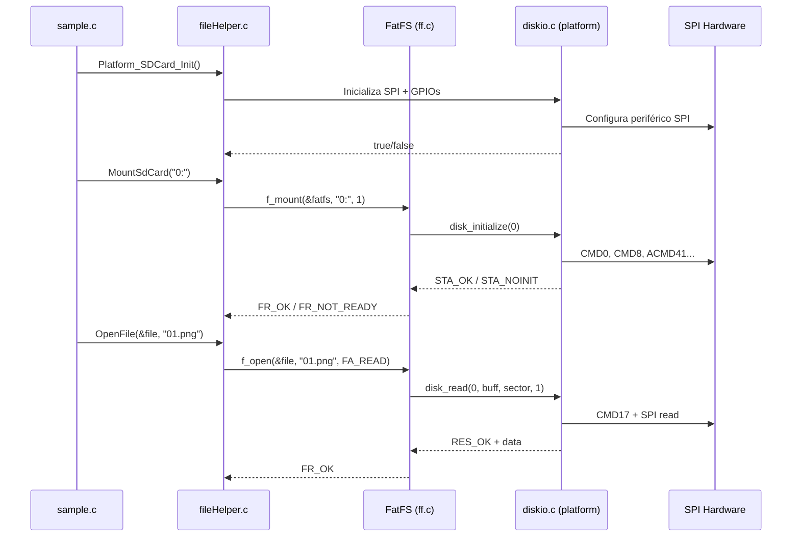

# Design Document: Multi-Platform FatFS

## Overview

Este design descreve a refatoração do gui.ll de uma arquitetura mono-plataforma (RP2040 com `no-OS-FatFS`) para multi-plataforma (RP2040 + ESP32) usando o FatFS puro de ChaN. A mudança central é substituir o submódulo `no-OS-FatFS` — que embute lógica SPI/SD específica para RP2040 — pelo FatFS genérico, implementando a interface `diskio.h` separadamente para cada plataforma.

O projeto é uma **biblioteca/subprojeto** (não um aplicativo standalone). O `CMakeLists.txt` raiz é um exemplo funcional para o projeto pai, que inclui fragmentos `.cmake` da plataforma selecionada.

### Decisões Arquiteturais Chave

1. **FatFS puro como submódulo**: Adicionado em `src/Dependency/fatfs/` — fornece `ff.c`, `ffsystem.c`, `ffunicode.c`, `ff.h`, `diskio.h`, `ffconf.h`
2. **Um `diskio.c` por plataforma**: Cada plataforma implementa as 5 funções da interface `diskio.h` usando suas APIs nativas de SPI
3. **Seleção por `PLATFORM_NAME`**: Variável CMake (padrão `RP2040`) seleciona fragmentos `.cmake` e `diskio.c` corretos
4. **`Platform_SDCard_Init`**: Nova função de inicialização que encapsula configuração SPI por plataforma, chamada antes de `f_mount`
5. **Sem `idf.py`**: ESP32 usa ESP-IDF apenas como dependência CMake via `ESP_IDF_PATH`

## Architecture



### Estrutura Final de Diretórios

```
CMakeLists.txt                          (exemplo — usa PLATFORM_NAME)
src/
  sample.c
  Dependency/
    pico_sdk_import.cmake
    fatfs/                              (novo submódulo ChaN FatFS)
      source/
        ff.c, ff.h, diskio.h
        ffsystem.c, ffunicode.c
        ffconf.h
    zlib/
    libpng/
  lib/
    Platform/
      RP2040/
        Platform.c                      (display/GPIO — inalterado)
        diskio.c                        (novo — implementação diskio para RP2040)
        platform_config.h               (novo — pinos SPI SD card)
        pre-executable.cmake            (movido de src/, atualizado)
        pos-executable.cmake            (movido de src/, atualizado)
      ESP32/
        Platform.c                      (novo — display/GPIO para ESP32)
        diskio.c                        (novo — implementação diskio para ESP32)
        platform_config.h               (novo — pinos SPI SD card)
        pre-executable.cmake            (novo)
        pos-executable.cmake            (novo)
    Helper/
      fileHelper.c                      (refatorado — sem hw_config.h)
      pngHelper.c                       (inalterado)
    Driver/GC9A01/
    GUI/
    LCD/
    Fonts/
```

## Components and Interfaces

### 1. Interface `diskio.h` (fornecida pelo FatFS)

A interface que cada plataforma deve implementar:

```c
/* Protótipos da interface diskio — definidos em diskio.h do FatFS */
DSTATUS disk_initialize(BYTE pdrv);
DSTATUS disk_status(BYTE pdrv);
DRESULT disk_read(BYTE pdrv, BYTE* buff, LBA_t sector, UINT count);
DRESULT disk_write(BYTE pdrv, const BYTE* buff, LBA_t sector, UINT count);
DRESULT disk_ioctl(BYTE pdrv, BYTE cmd, void* buff);
```

### 2. Interface `Platform_SDCard_Init`

Nova função de abstração de plataforma para inicialização do SD card:

```c
/* Declarada em platform_config.h de cada plataforma */
/**
 * Inicializa o barramento SPI e configura os GPIOs para o cartão SD.
 * Deve ser chamada antes de f_mount().
 * @return true se a inicialização teve sucesso, false caso contrário.
 */
bool Platform_SDCard_Init(void);
```

### 3. Configuração de Pinos (`platform_config.h`)

Cada plataforma define seus pinos padrão, sobrescrevíveis via flags de compilação:

```c
/* src/lib/Platform/RP2040/platform_config.h */
#ifndef HAL_CONFIG_H
#define HAL_CONFIG_H

#include <stdbool.h>

/* Pinos SPI padrão para SD Card — sobrescrevíveis via -DSD_SPI_SCLK=X */
#ifndef SD_SPI_SCLK
#define SD_SPI_SCLK 18
#endif
#ifndef SD_SPI_MOSI
#define SD_SPI_MOSI 19
#endif
#ifndef SD_SPI_MISO
#define SD_SPI_MISO 16
#endif
#ifndef SD_SPI_CS
#define SD_SPI_CS 17
#endif

/* Velocidade SPI nominal para dados SD */
#ifndef SD_SPI_BAUDRATE
#define SD_SPI_BAUDRATE (25 * 1000 * 1000)
#endif

bool Platform_SDCard_Init(void);

#endif /* HAL_CONFIG_H */
```

### 4. `fileHelper.c` Refatorado

O arquivo perde todas as referências ao `no-OS-FatFS` e passa a usar apenas a API FatFS padrão:

```c
/* Antes (removido): */
// #include "hw_config.h"
// static spi_t spis[] = { ... };
// static sd_card_t sd_cards[] = { ... };
// size_t sd_get_num(void) { ... }

/* Depois: */
#include "ff.h"
#include "platform_config.h"

static FATFS fatfs;

bool MountSdCard(const char* drive) {
    FRESULT result = f_mount(&fatfs, drive, 1);
    if (result != FR_OK) {
        printf("f_mount error: %d\n", result);
        return false;
    }
    return true;
}
```

### 5. Sistema de Build CMake

#### CMakeLists.txt raiz (exemplo)

```cmake
cmake_minimum_required(VERSION 3.13)
set(CMAKE_C_STANDARD 11)
set(CMAKE_CXX_STANDARD 14)

# Seleção de plataforma
if(NOT DEFINED PLATFORM_NAME)
    set(PLATFORM_NAME "RP2040")
endif()

# SDK paths por plataforma
if(PLATFORM_NAME STREQUAL "RP2040")
    if(NOT DEFINED PICO_SDK_PATH)
        set(PICO_SDK_PATH ~/pico-sdk)
    endif()
    include(${CMAKE_SOURCE_DIR}/src/Dependency/pico_sdk_import.cmake)
elseif(PLATFORM_NAME STREQUAL "ESP32")
    if(NOT DEFINED ESP_IDF_PATH)
        set(ESP_IDF_PATH ~/esp-idf)
    endif()
endif()

project(gui.ll)

# Inicialização específica da plataforma
if(PLATFORM_NAME STREQUAL "RP2040")
    pico_sdk_init()
endif()

# Incluir fragmentos de plataforma
include(${CMAKE_SOURCE_DIR}/src/lib/Platform/${PLATFORM_NAME}/pre-executable.cmake)

add_executable(${PROJECT_NAME} src/sample.c)

include(${CMAKE_SOURCE_DIR}/src/lib/Platform/${PLATFORM_NAME}/pos-executable.cmake)

# Extras do RP2040 (somente se aplicável)
if(PLATFORM_NAME STREQUAL "RP2040")
    pico_enable_stdio_usb(${PROJECT_NAME} 1)
    pico_enable_stdio_uart(${PROJECT_NAME} 0)
    pico_add_extra_outputs(${PROJECT_NAME})
endif()
```

#### RP2040 `pre-executable.cmake`

```cmake
# Compilar FatFS puro
set(FATFS_SRC ${CMAKE_SOURCE_DIR}/src/Dependency/fatfs/source)
add_library(fatfs STATIC
    ${FATFS_SRC}/ff.c
    ${FATFS_SRC}/ffsystem.c
    ${FATFS_SRC}/ffunicode.c
    ${CMAKE_SOURCE_DIR}/src/lib/Platform/RP2040/diskio.c
)
target_include_directories(fatfs PUBLIC ${FATFS_SRC})
target_include_directories(fatfs PRIVATE ${CMAKE_SOURCE_DIR}/src/lib/Platform/RP2040)
```

#### ESP32 `pre-executable.cmake`

```cmake
# Compilar FatFS puro
set(FATFS_SRC ${CMAKE_SOURCE_DIR}/src/Dependency/fatfs/source)
add_library(fatfs STATIC
    ${FATFS_SRC}/ff.c
    ${FATFS_SRC}/ffsystem.c
    ${FATFS_SRC}/ffunicode.c
    ${CMAKE_SOURCE_DIR}/src/lib/Platform/ESP32/diskio.c
)
target_include_directories(fatfs PUBLIC ${FATFS_SRC})
target_include_directories(fatfs PRIVATE ${CMAKE_SOURCE_DIR}/src/lib/Platform/ESP32)

# ESP-IDF como dependência CMake
list(APPEND CMAKE_MODULE_PATH ${ESP_IDF_PATH}/tools/cmake)
include(idf)
```

## Data Models

### Dados em Memória

Não há modelos de dados complexos neste projeto. Os principais tipos são fornecidos pelo FatFS:

| Tipo | Origem | Uso |
|------|--------|-----|
| `FATFS` | `ff.h` | Estrutura do workspace do filesystem montado |
| `FIL` | `ff.h` | Handle de arquivo aberto |
| `FRESULT` | `ff.h` | Código de resultado das operações FatFS |
| `DSTATUS` | `diskio.h` | Status do disco (bitmask: `STA_NOINIT`, `STA_NODISK`, `STA_PROTECT`) |
| `DRESULT` | `diskio.h` | Resultado de operação de disco (`RES_OK`, `RES_ERROR`, `RES_WRPRT`, `RES_NOTRDY`, `RES_PARERR`) |

### Estado Interno do `diskio.c`

Cada implementação de `diskio.c` mantém estado interno sobre o cartão SD:

```c
/* Estado interno mantido pelo diskio de cada plataforma */
typedef struct {
    bool initialized;       /* true após disk_initialize bem-sucedido */
    uint32_t sector_count;  /* número total de setores do cartão */
    uint16_t sector_size;   /* tamanho do setor (tipicamente 512) */
    uint32_t block_size;    /* tamanho do bloco de apagamento */
} sd_card_state_t;
```

### Fluxo de Dados




## Correctness Properties

*A property is a characteristic or behavior that should hold true across all valid executions of a system — essentially, a formal statement about what the system should do. Properties serve as the bridge between human-readable specifications and machine-verifiable correctness guarantees.*

A maioria dos requisitos deste projeto envolve configuração de build system (SMOKE), integração com hardware (INTEGRATION), ou verificações estáticas de código (EXAMPLE). O Requirement 9 (tratamento de erros na camada diskio) contém lógica pura que se beneficia de property-based testing, pois valida comportamento que deve ser correto para **qualquer** combinação de entradas.

### Property 1: Initialization failure returns STA_NOINIT

*For any* SPI bus failure mode (timeout, bus error, no card detected, invalid response), `disk_initialize` SHALL return a status with the `STA_NOINIT` flag set.

**Validates: Requirements 9.1**

### Property 2: Uninitialized disk blocks all operations

*For any* sector number, count value, buffer, and ioctl command, when the disk is in `STA_NOINIT` state, calling `disk_read`, `disk_write`, or `disk_ioctl` SHALL return an error result (`RES_NOTRDY`) without performing any SPI hardware access.

**Validates: Requirements 9.2**

### Property 3: Out-of-bounds sector returns RES_PARERR

*For any* sector number that is greater than or equal to the card's `sector_count`, and *for any* `count` value, both `disk_read` and `disk_write` SHALL return `RES_PARERR` without issuing SPI commands.

**Validates: Requirements 9.3, 9.4**

### Property 4: SPI failure during I/O returns RES_ERROR

*For any* valid sector number and count where the underlying SPI transfer fails (returns error status), `disk_read` and `disk_write` SHALL return `RES_ERROR`.

**Validates: Requirements 9.5**

### Property 5: Unsupported ioctl command returns RES_PARERR

*For any* ioctl command byte value that is NOT one of `CTRL_SYNC`, `GET_SECTOR_COUNT`, `GET_SECTOR_SIZE`, or `GET_BLOCK_SIZE`, `disk_ioctl` SHALL return `RES_PARERR`.

**Validates: Requirements 9.6**

## Error Handling

### Camada diskio

| Situação | Comportamento | Código Retornado |
|----------|---------------|------------------|
| SPI init falha / cartão não detectado | `disk_initialize` retorna erro | `STA_NOINIT` |
| Operação chamada com disco não inicializado | Retorno imediato sem acessar hardware | `RES_NOTRDY` |
| Setor fora dos limites em read/write | Retorno imediato sem SPI | `RES_PARERR` |
| Falha na transferência SPI | Retorno após tentativa | `RES_ERROR` |
| Comando ioctl não suportado | Retorno imediato | `RES_PARERR` |
| Disco protegido contra escrita | `disk_write` retorna erro | `RES_WRPRT` |

### Camada fileHelper (Application)

| Situação | Comportamento |
|----------|---------------|
| `Platform_SDCard_Init` retorna false | Aborta inicialização, não chama `f_mount` |
| `f_mount` retorna erro | Loga o erro via `printf`, retorna false |
| `f_open` retorna erro | Loga, desmonta filesystem, retorna false |
| `f_close` retorna erro | Loga o erro (não-fatal, operação já concluída) |

### Estratégia de Propagação

Erros fluem de baixo para cima:
1. **SPI hardware** → erro no driver SPI da plataforma
2. **diskio.c** → converte para `DRESULT` (`RES_ERROR`, `RES_PARERR`)
3. **FatFS (ff.c)** → converte para `FRESULT` (`FR_DISK_ERR`, `FR_NOT_READY`)
4. **fileHelper.c** → loga mensagem e retorna `bool` para a aplicação

Não há exceções, panics, ou alocação dinâmica no caminho de erro.

## Testing Strategy

### Abordagem Dual

| Tipo de Teste | Escopo | Ferramentas |
|---------------|--------|-------------|
| **Property-based** | Lógica de erro do diskio (Properties 1-5) | CMocka + custom PBT runner ou theft (C PBT library) |
| **Unit tests** | fileHelper.c refatorado, validação de parâmetros | CMocka com mocks de FatFS |
| **Integration tests** | Build completo RP2040/ESP32, hardware real | CMake + hardware-in-the-loop |
| **Smoke tests** | Estrutura de arquivos, configuração CMake | Shell scripts / CTest |
| **Static analysis** | Isolamento de plataforma (sem includes cruzados) | Grep-based lint rules em CI |

### Property-Based Testing

**Biblioteca**: [theft](https://github.com/silentbicycle/theft) — uma biblioteca PBT para C, leve e sem dependências externas, adequada para embedded.

**Configuração**:
- Mínimo 100 iterações por property test
- Mock do SPI hardware via function pointers (dependency injection no diskio)
- Cada teste tagged com referência ao design property

**Tag format**: `/* Feature: multi-platform-fatfs, Property {N}: {text} */`

**Estrutura para mocking do SPI**:

```c
/* Interface SPI injetável para testes */
typedef struct {
    int (*spi_init)(uint32_t baudrate);
    int (*spi_transfer)(const uint8_t* tx, uint8_t* rx, size_t len);
    void (*gpio_set)(uint pin, uint value);
} spi_ops_t;

/* Em produção: aponta para funções reais do SDK */
/* Em testes: aponta para mocks que simulam falhas */
```

**Geradores para PBT**:

- Setor: `uint32_t` arbitrário (inclui valores > sector_count)
- Count: `uint16_t` arbitrário
- Comando ioctl: `uint8_t` arbitrário (inclui valores fora do set suportado)
- Estado do disco: `{NOINIT, READY}`
- Modo de falha SPI: `{OK, TIMEOUT, BUS_ERROR, NO_RESPONSE}`

### Unit Tests (example-based)

- `fileHelper.c`: Verificar que `MountSdCard` chama `f_mount`, que `Platform_SDCard_Init` é chamado antes, que erros são propagados corretamente
- Validação de compilação: Verificar que `hw_config.h`, `spi_t`, `sd_card_t` não existem no código refatorado
- CMake: Verificar que `PLATFORM_NAME=RP2040` e `PLATFORM_NAME=ESP32` configuram sem erro

### Integration Tests

- Build RP2040: Compila e gera `.uf2` com sucesso
- Build ESP32: Compila com sucesso usando ESP-IDF via CMake
- Hardware: Montar SD card, ler arquivo, verificar conteúdo (manual ou CI com hardware)

### Smoke Tests (CTest)

```cmake
# Verificar que no-OS-FatFS não existe
add_test(NAME no_legacy_fatfs
    COMMAND ${CMAKE_COMMAND} -E env test ! -d ${CMAKE_SOURCE_DIR}/src/Dependency/no-OS-FatFS)

# Verificar que fatfs submodule existe
add_test(NAME fatfs_submodule_exists
    COMMAND ${CMAKE_COMMAND} -E env test -f ${CMAKE_SOURCE_DIR}/src/Dependency/fatfs/source/ff.h)
```
