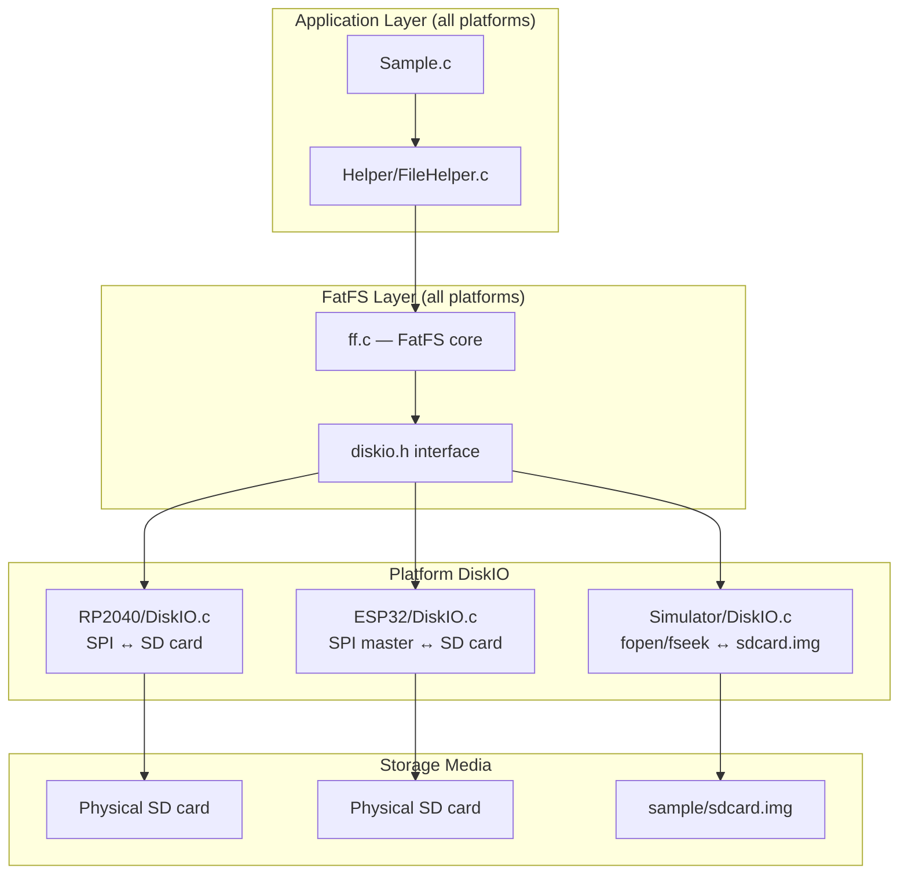

# Design Document

## Overview

This design eliminates the Simulator-specific POSIX file I/O shim (`Platform/Simulator/FileHelper.c`, `FileHelper.h`, `ff.h`) and replaces it with a new `Platform/Simulator/DiskIO.c` that backs FatFS against a local FAT-formatted disk image file (`sample/sdcard.img`). After this refactoring, all three platforms (RP2040, ESP32, Simulator) share the identical `Helper/FileHelper.c` → FatFS → platform `DiskIO.c` stack, making file I/O behavior consistent across targets and eliminating dead code.

Key changes:
1. New `src/lib/Platform/Simulator/DiskIO.c` — implements `disk_initialize`, `disk_status`, `disk_read`, `disk_write`, `disk_ioctl`, and `SDCardInit` using POSIX `fopen`/`fseek`/`fread`/`fwrite`/`fflush` against a disk image file.
2. Updated `Toolchain/Simulator/Setup.sh` — installs `dosfstools` + `mtools`, creates `sample/sdcard.img` on every run.
3. Updated `CMakeLists.txt` (Simulator block) — compiles FatFS sources + new DiskIO + shared FileHelper; adds FatFS include path; removes old shim.
4. Updated `Platform/Simulator/HALConfig.h` — replaces `SD_DIRECTORY` with `SD_DISK_IMAGE`.
5. Deleted `Platform/Simulator/FileHelper.c`, `FileHelper.h`, `ff.h` (the shim files).

## Architecture

The refactored Simulator I/O stack mirrors the hardware platforms exactly:



The shared `FileHelper.c` calls FatFS functions (`f_mount`, `f_open`, `f_read`, `f_close`, `f_chdrive`, `f_unmount`). FatFS calls the `disk_*` interface. Each platform provides its own `DiskIO.c` that implements those functions against the platform's storage medium.

## Components and Interfaces

### 1. Simulator DiskIO (`src/lib/Platform/Simulator/DiskIO.c`)

Implements the FatFS diskio contract using standard C file I/O against a flat disk image file.

**Includes:**
- `"ff.h"` (resolves to `src/Dependency/fatfs/source/ff.h`)
- `"diskio.h"` (from FatFS)
- `"HALConfig.h"` (for `SD_DISK_IMAGE` path)
- `<stdio.h>`, `<stdbool.h>`

**Static state:**
- `static FILE *diskFile = NULL;` — the open disk image file handle

**Functions (FatFS contract):**

| Function | Behavior |
|----------|----------|
| `disk_initialize(BYTE pdrv)` | Opens `SD_DISK_IMAGE` with `fopen("rb+")`. Returns `0` on success, `STA_NOINIT` on failure. Only `pdrv == 0` accepted. |
| `disk_status(BYTE pdrv)` | Returns `0` if `diskFile != NULL`, else `STA_NOINIT`. |
| `disk_read(BYTE pdrv, BYTE *buff, LBA_t sector, UINT count)` | `fseek` to `sector * 512`, `fread` `count * 512` bytes. |
| `disk_write(BYTE pdrv, const BYTE *buff, LBA_t sector, UINT count)` | `fseek` to `sector * 512`, `fwrite` `count * 512` bytes. |
| `disk_ioctl(BYTE pdrv, BYTE cmd, void *buff)` | `CTRL_SYNC`: `fflush(diskFile)`. `GET_SECTOR_SIZE`: 512. `GET_BLOCK_SIZE`: 1. `GET_SECTOR_COUNT`: derived from file size via `fseek`/`ftell`. |

**Project-convention function:**

| Function | Behavior |
|----------|----------|
| `SDCardInit(void)` | Calls `disk_initialize(0)` and returns `true` if status is `0`. |

### 2. HALConfig Update (`src/lib/Platform/Simulator/HALConfig.h`)

- Remove: `#define SD_DIRECTORY "sample/sdcard"`
- Add: `#define SD_DISK_IMAGE "sample/sdcard.img"`

All other defines (dummy pins, etc.) remain unchanged.

### 3. Setup Script Update (`Toolchain/Simulator/Setup.sh`)

New behavior added after existing package installation:
1. Add `dosfstools` and `mtools` to the package list.
2. Always recreate `sample/sdcard.img`:
   - Compute required size from `sample/sdcard/` contents (minimum 1 MB).
   - `dd if=/dev/zero of=sample/sdcard.img bs=1M count=<size>` — create zeroed file.
   - `mkfs.fat sample/sdcard.img` — format as FAT12/16.
   - `mcopy -i sample/sdcard.img sample/sdcard/* ::` — copy sample files into the image.

The script remains idempotent for package installation; the disk image is always regenerated (not idempotent — intentional so sample file changes are always reflected).

### 4. CMake Simulator Block Update (`CMakeLists.txt`)

Changes to `elseif(PLATFORM_NAME STREQUAL "Simulator")`:

- **Remove** `Platform/Simulator/FileHelper.c` from `GUILL_SIM_SRCS`.
- **Add** to `GUILL_SIM_SRCS`:
  - `src/lib/Platform/Simulator/DiskIO.c`
  - `src/lib/Helper/FileHelper.c`
  - `src/Dependency/fatfs/source/ff.c`
  - `src/Dependency/fatfs/source/ffsystem.c`
  - `src/Dependency/fatfs/source/ffunicode.c`
- **Add** `include(${CMAKE_SOURCE_DIR}/src/Dependency/fatfs.ffconf_patch.cmake)` before the `add_executable` to apply the ffconf patch.
- **Add** `include_directories(${CMAKE_SOURCE_DIR}/src/Dependency/fatfs/source)` so `#include "ff.h"` and `#include "diskio.h"` resolve to the real FatFS headers.
- **Remove** the `Platform/Simulator` include directory comes after the FatFS include directory (or remove it entirely if no longer needed) — actually it must remain for `HAL.h`, `HALConfig.h`, `RTC.h`. The key is that FatFS include path is listed so `ff.h` resolves to the real one. Since `Platform/Simulator/ff.h` (the shim) will be deleted, the include order becomes irrelevant.

### 5. File Deletions

After the refactoring, these files are removed from the repository:
- `src/lib/Platform/Simulator/FileHelper.c`
- `src/lib/Platform/Simulator/FileHelper.h`
- `src/lib/Platform/Simulator/ff.h`

### 6. Shared FileHelper (`src/lib/Helper/FileHelper.c`)

No changes needed. It already uses FatFS APIs and forward-declares `SDCardInit`. The Simulator build will now link against the real FatFS and the new Simulator DiskIO, so it will resolve all symbols correctly.

## Data Models

### Disk Image Layout

The `sample/sdcard.img` file is a raw FAT filesystem image:
- **Format**: FAT12 or FAT16 (determined by `mkfs.fat` based on size)
- **Sector size**: 512 bytes
- **Minimum size**: 1 MB (sufficient for FAT metadata + sample files)
- **Contents**: Files copied from `sample/sdcard/` directory (currently `01.png`)

The DiskIO implementation treats the file as a flat array of 512-byte sectors. Sector N maps to file offset `N * 512`.

### DiskIO State

```c
static FILE *diskFile;  /* NULL when not initialized */
```

The `diskFile` handle serves dual purpose:
- Non-NULL indicates initialized status (used by `disk_status`)
- Used for all seek/read/write/flush operations

## Error Handling

| Scenario | Behavior |
|----------|----------|
| Disk image file missing | `disk_initialize` returns `STA_NOINIT`; `SDCardInit` returns `false`; `MountSdCard` prints error and returns `false` |
| `fseek` fails in read/write | Return `RES_ERROR` |
| `fread` returns fewer bytes than requested | Return `RES_ERROR` |
| `fwrite` returns fewer bytes than requested | Return `RES_ERROR` |
| Invalid `pdrv` (not 0) | Return `STA_NOINIT` / `RES_PARERR` as per FatFS convention |
| `disk_ioctl` unknown command | Return `RES_PARERR` |

Error messages from `FileHelper.c` (via `printf`) remain unchanged — they already report FatFS error codes which will now be real FatFS errors rather than the shim's limited `FR_OK`/`FR_INVALID_OBJECT`.

## Testing Strategy

Per the project's **DO NOT WRITE TESTS** policy, no automated tests are written.

**Verification approach:**
1. **Build verification**: Run `cmake .. -DPLATFORM_NAME=Simulator && make` — must compile and link without errors.
2. **Runtime verification**: Execute `./build/gui.ll` — the Simulator must mount the disk image via FatFS, open and decode the PNG from it, and display it in the SDL2 window identically to the previous POSIX-based behavior.
3. **Setup script verification**: Run `Toolchain/Simulator/Setup.sh` — must install packages and produce a valid `sample/sdcard.img` containing the sample files.
4. **RP2040/ESP32 build regression**: Ensure RP2040 full build completes without errors (existing `DiskIO.c` + shared `FileHelper.c` unchanged).

**What correctness means for this refactoring:**
- The Simulator produces the same visual output (PNG displayed in SDL2 window) as before.
- FatFS mount/open/read/close operations succeed against the disk image.
- RP2040 and ESP32 builds are unaffected (no source changes to their code paths).
